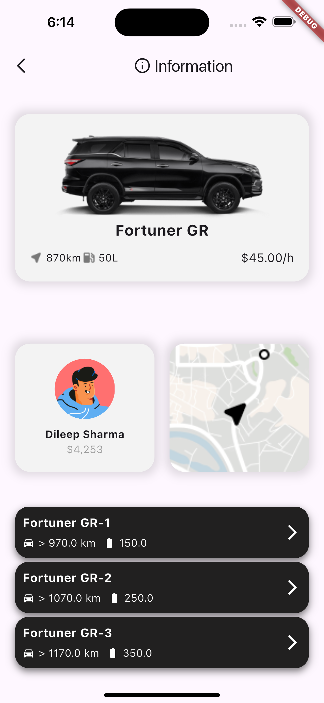
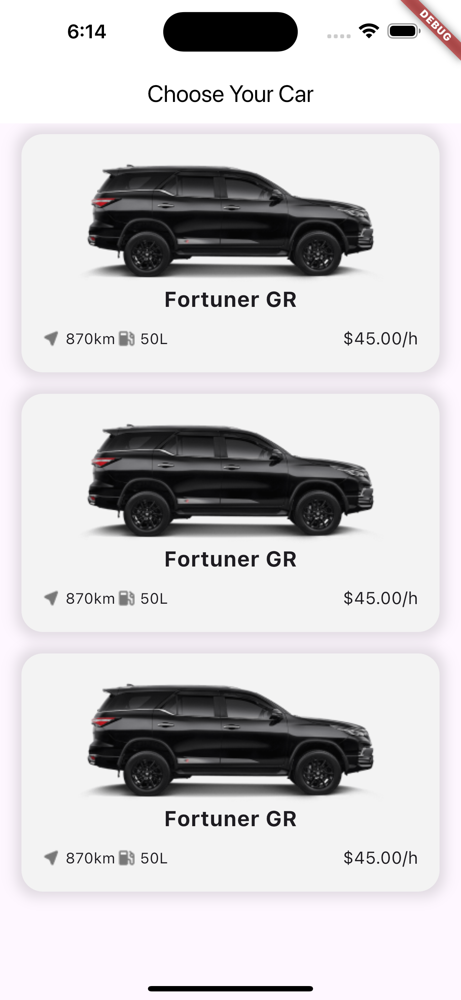
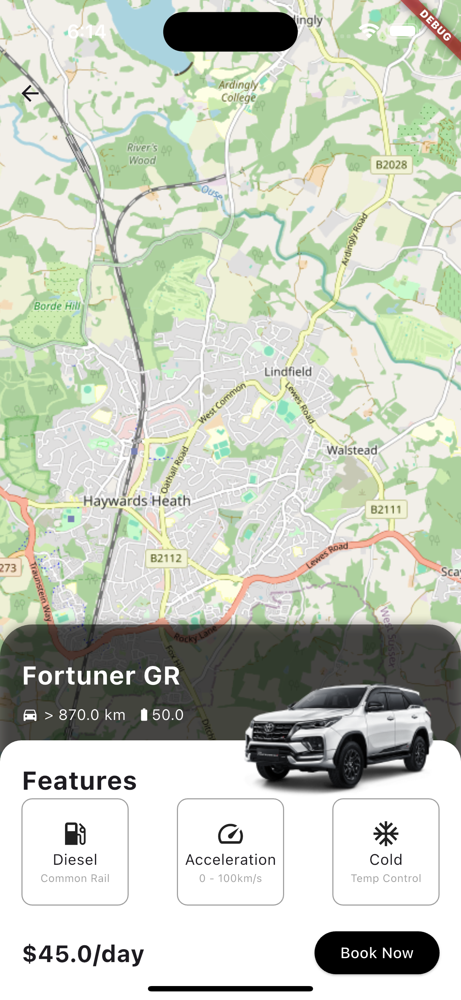

# Car Rental Application

This project is a demo car rental application built with Flutter and Firebase, using the Google Maps API for map functionalities. It follows Clean Architecture principles, serving as a practice project to refresh Flutter knowledge.

## Project Overview

This car rental application demonstrates the following key features:

- **Onboarding Page:** A sleek welcome page introducing the application to users.
- **Car Details Page:** Displays detailed information about selected cars, including images, description, and booking options.
- **Car List Page:** A list of various cars available for rent, each with a brief description and image.
- **Map Details Page:** Integration with Google Maps to show the locations of cars available for rental.

This project is not a complete, fully functional application but a demo project to explore various Flutter features and Firebase integration.

### Architecture

The project is built using **Clean Architecture** to separate concerns and make the codebase modular, maintainable, and scalable. It follows these layers:

- **Presentation Layer:** Handles the UI components, state management, and user interaction.
- **Domain Layer:** Contains business logic and entities.
- **Data Layer:** Responsible for data management, including Firebase interactions and mapping data models.

### Technologies Used

- **Flutter** for building the cross-platform mobile application.
- **Firebase** for backend services such as authentication, real-time database, and storage.
- **Google Maps API** for displaying car locations on an interactive map.
- **Clean Architecture** to maintain a scalable codebase.

### Screenshots

| Onboarding Page                             | Car Details Page                              | Car List Page                           | Map Details Page                              |
| ------------------------------------------- | --------------------------------------------- | --------------------------------------- | --------------------------------------------- |
|  |  |  |  |

### Project Structure

Here is an overview of the key directories and files in the `lib` folder:

- **lib/data/models:** Contains data models for the application, such as `car_model.dart`.
- **lib/presentation/pages:** Holds the UI pages, including `onboarding_page.dart`, `car_details_page.dart`, `car_list_screen.dart`, and `maps_details_page.dart`.
- **lib/presentation/widgets:** Reusable UI components like `car_card.dart`.

## Notes

This project serves as a technical demo and a refreshing exercise in Flutter development. It does not include full application functionality or production-level code.
